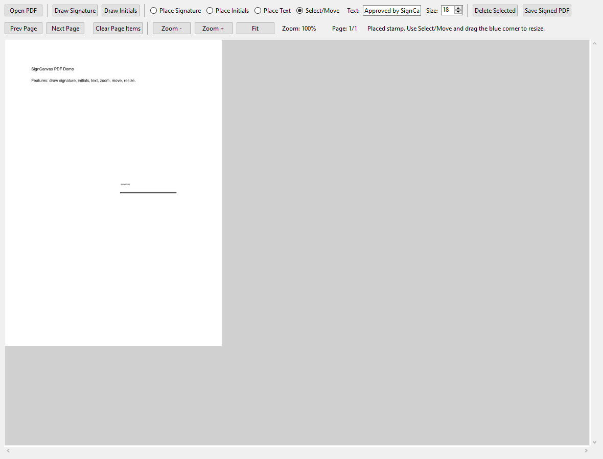
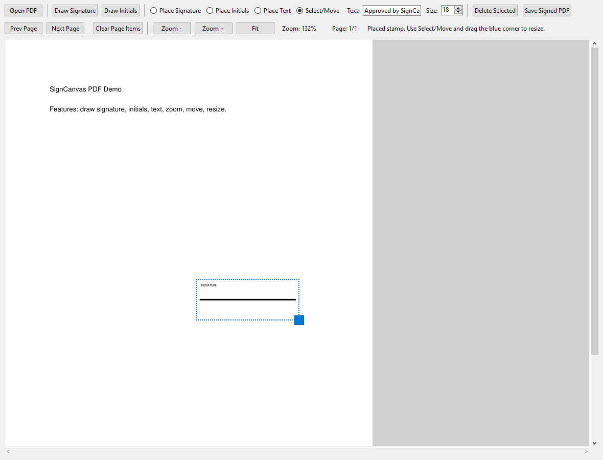

# SignCanvas PDF

Draw signatures and initials, drop them anywhere in a PDF, add text boxes, and export a clean signed copy.

## Why This App
- Fast local signing workflow
- No cloud upload required
- Precise placement with move + resize controls
- Reuses your last initials/signature size for quicker repeated signing

## Screenshots

### Main Editor


### Zoom + Resize Workflow


## Features
- Open any PDF
- Draw and save `signature` and `initials`
- Create typed signatures in cursive-style fonts (no drawing required)
- Create typed initials in cursive-style fonts (no drawing required)
- Choose ink color for signatures/initials (preset or custom)
- Place signatures/initials with one click
- Move items with drag-and-drop
- Resize signatures/initials from the bottom-right handle area
- Add text boxes with configurable size
- Zoom controls:
  - `Zoom +`, `Zoom -`, `Fit`
  - `Ctrl + Mouse Wheel`
  - `Ctrl + +`, `Ctrl + -`, `Ctrl + 0`
- Save output as a new signed PDF

## Quick Start

```powershell
python -m venv .venv
.venv\Scripts\activate
pip install -r requirements.txt
python app.py
```

## Usage
1. Click `Open PDF`.
2. Create a signature with either:
   - `Draw Signature`
   - `Type Signature` (cursive-style font)
3. Create initials with either:
   - `Draw Initials`
   - `Type Initials` (cursive-style font)
4. Pick an `Ink` color.
5. Choose `Place Signature`, `Place Initials`, or `Place Text`.
6. Click on the page to place.
7. Switch to `Select/Move` to edit:
   - drag item to move
   - drag near bottom-right corner to resize signature/initials
   - press `Delete` to remove selected item
8. Click `Save Signed PDF`.

## Build EXE (Windows)
- Full guide: [docs/BUILD_WINDOWS.md](docs/BUILD_WINDOWS.md)

Quick command:

```powershell
python -m pip install pyinstaller
pyinstaller --noconfirm --clean --windowed --name SignCanvasPDF app.py
```

Output:
- `dist\SignCanvasPDF\SignCanvasPDF.exe`

## CI Build
- GitHub Actions workflow included: `.github/workflows/windows-build.yml`
- On every push to `main`, it builds a Windows EXE and uploads it as an artifact.

## Publish to GitHub
```powershell
# 1) Authenticate once
"C:\Program Files\GitHub CLI\gh.exe" auth login

# 2) Create and push repository (default: public signcanvas-pdf)
powershell -ExecutionPolicy Bypass -File .\scripts\publish_github.ps1
```

## Project Structure
- `app.py` - desktop app UI and PDF signing logic
- `requirements.txt` - runtime dependencies
- `docs/BUILD_WINDOWS.md` - EXE build instructions
- `scripts/capture_screenshots.py` - screenshot generator

## Notes
- Local stamp files are stored as `signature_stamp.png` and `initials_stamp.png` (ignored by git).
- For legal workflows, always verify final placement in the exported PDF before sharing.
